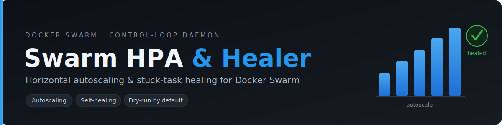
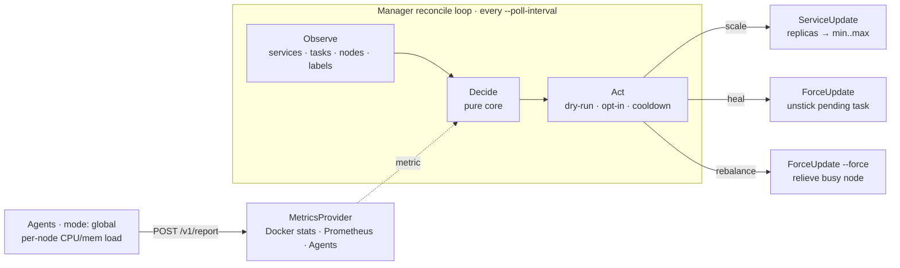

<p align="center">
  
</p>

<p align="center">
  <a href="https://github.com/Aleksey512/swarm-hpa/actions/workflows/ci.yml"></a>
  <a href="https://github.com/Aleksey512/swarm-hpa/tags"></a>
  <a href="https://hub.docker.com/r/mrframe/swarm-hpa"></a>
  <a href="https://hub.docker.com/r/mrframe/swarm-hpa"></a>
  <a href="https://hub.docker.com/r/mrframe/swarm-hpa/tags"></a>
  <br>
  
  <a href="go.mod"></a>
  <a href="https://goreportcard.com/report/github.com/Aleksey512/swarm-hpa"></a>
  <a href="LICENSE"></a>
</p>

<p align="center">
  <b>Horizontal autoscaling and stuck-task healing for Docker Swarm</b><br>
  opt-in · dry-run by default · fully logged
</p>

A small Go daemon that adds capabilities Swarm lacks out of the box: a
Horizontal Pod Autoscaler analogue that scales opt-in services by a metric, a
healer that recovers tasks stuck in `pending` under a placement constraint
after a node recovers ([moby/moby#42215](https://github.com/moby/moby/issues/42215)),
and load-aware task rebalancing across nodes. It manages real production
services, so every mutating action is opt-in (via labels), gated by dry-run +
cooldown, and logged.

## Quick Start

```bash
make build                      # → bin/swarm-hpa
./bin/swarm-hpa                 # dry-run is ON by default: nothing is mutated
```

Prefer a prebuilt image? Every release publishes a multi-arch image to GHCR
(primary) and Docker Hub:

```bash
docker run --rm ghcr.io/aleksey512/swarm-hpa:latest --version   # or docker.io/mrframe/swarm-hpa:latest
```

Mark a service for management and watch the daemon decide (still dry-run):

```bash
docker service update \
  --label-add swarm.autoscaler.enabled=true \
  --label-add swarm.autoscaler.min=2 \
  --label-add swarm.autoscaler.max=10 \
  --label-add swarm.autoscaler.metric=cpu \
  --label-add swarm.autoscaler.target=70 \
  web

./bin/swarm-hpa --dry-run=false      # enable real scaling/healing
```

## Key Features

- **Horizontal autoscaling** of opt-in services between `min`/`max` by a target metric and threshold.
- **Pluggable metrics**, chosen per service: **Docker stats** (CPU/memory, no deps), **Prometheus** (arbitrary PromQL — RPS, p95 latency, queue depth), or **agents** (cluster-wide CPU/memory, no Prometheus).
- **Manager / agent split** — one binary, two roles. The default **manager** runs the reconcile loop; optional per-node **agents** (`mode: global`) report local load so stats autoscaling works across the **whole cluster**, not just the manager's node.
- **Stuck-task healer** — force-updates a service only when the precise stuck-pending signature holds and the constrained node has recovered. Opt in independently with `swarm.autoscaler.heal=true`.
- **Load-aware rebalancing** — Swarm spreads tasks by count, not load; the manager detects node-CPU skew and can relieve a busy node. Opt in with `swarm.autoscaler.rebalance=true` (dry-run + long cooldown).
- **Opt-in via labels** — a service is touched only when it carries `swarm.autoscaler.*` labels (`enabled=true` autoscale, `heal=true` heal, `rebalance=true` rebalance).
- **Dry-run by default** — out of the box the daemon only logs intended actions.
- **Safe mutations** — one guarded path enforces dry-run + per-service cooldown; replica changes are clamped to `min`/`max`.

## How it works

The **manager** runs a single reconcile loop every `--poll-interval`: **observe**
the Swarm, **decide** in a pure core, then **act** through one guarded path
(dry-run + opt-in labels + cooldown). Optional per-node **agents** push local
per-task CPU/memory to the manager, feeding cluster-wide autoscaling and the
load-aware rebalance decision.



## Example

```bash
# Scale "api" on a Prometheus signal (requests/sec per replica target = 50)
docker service update \
  --label-add swarm.autoscaler.enabled=true \
  --label-add swarm.autoscaler.min=3 --label-add swarm.autoscaler.max=20 \
  --label-add swarm.autoscaler.metric=rps --label-add swarm.autoscaler.target=50 \
  --label-add swarm.autoscaler.source=prometheus \
  --label-add 'swarm.autoscaler.query=sum(rate(http_requests_total{service="$SERVICE"}[1m]))/scalar(count(up{service="$SERVICE"}))' \
  api

./bin/swarm-hpa --dry-run=false \
  --metrics-provider=prometheus --prometheus-url=http://prometheus:9090
```

---

## Documentation

| Guide | Description |
|-------|-------------|
| [Getting Started](docs/getting-started.md) | Prerequisites, build, run, verify |
| [Examples](examples/README.md) | Runnable demos: CPU + Prometheus autoscaling and the stuck-task healer |
| [Configuration](docs/configuration.md) | Daemon flags/env and `swarm.autoscaler.*` service labels |
| [Metrics Providers](docs/metrics-providers.md) | Docker stats vs Prometheus vs agents, per-service routing, PromQL |
| [Agents & Rebalancing](docs/agents-and-rebalancing.md) | Manager/agent split, cluster-wide metrics, load-aware rebalancing |
| [Observability](docs/observability.md) | The daemon's own `/metrics` endpoint and metric catalog |
| [Development](docs/development.md) | Build, test, the integration harness, and CI |
| [Deployment](docs/deployment.md) | Container image, Swarm stack, least-privilege, upgrades |

## License

MIT — see [LICENSE](LICENSE).
